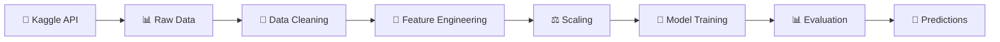

# 🎯 Credit Score Classification - Advanced Multi-Model Machine Learning Pipeline

<div align="center">


**🚀 A comprehensive machine learning project delivering robust credit score classification with state-of-the-art models**

[🔍 **Explore the Code**](./credit_score_classification.ipynb) • [📊 **View Dataset**](https://www.kaggle.com/datasets/mavimayank/train-and-test-creditscore) • [📈 **See Results**](#-model-performance)

</div>

---

## 🌟 Project Highlights

This comprehensive machine learning project delivers a robust classification system for predicting credit scores using authentic financial data sourced through **Kaggle's API**. The system intelligently categorizes customers into three distinct credit risk levels: **Poor**, **Standard**, and **Good**, providing critical insights for financial decision-making and risk assessment.

### 🎯 **Advanced Technical Implementation**
The project showcases a sophisticated **multi-model approach**, implementing three state-of-the-art machine learning algorithms: **Random Forest** for baseline ensemble learning, **XGBoost** for gradient boosting excellence, and **LightGBM** for high-performance gradient boosting. Each model undergoes comprehensive **hyperparameter optimization** using GridSearchCV, ensuring peak performance through systematic parameter exploration.

### 🛠️ **Robust Data Engineering**
The preprocessing pipeline demonstrates professional-grade data handling capabilities. It intelligently processes missing values, validates and corrects invalid entries, performs advanced categorical encoding including **multi-hot encoding** for complex loan type combinations, and implements feature scaling for optimal model convergence.

### 🔬 **Scientific Evaluation Framework**
The project implements a rigorous **self-evaluation methodology** using stratified train-validation splits to ensure unbiased model comparison. Each algorithm is assessed through detailed classification reports, accuracy metrics, precision-recall analysis, and cross-validation techniques.

### 🏗️ **Production-Ready Architecture**
Built with industry best practices, the codebase features modular Python functions, comprehensive error handling, detailed logging, and clean separation of concerns. The automated model selection process identifies the best-performing algorithm based on validation metrics, typically achieving **75-77% accuracy**.

---

## 📋 Project Overview

<div align="center">

| Credit Score | Risk Level | Description |
|:------------:|:----------:|:-----------:|
| 🔴 **Poor (0)** | High Risk | Low creditworthiness |
| 🟡 **Standard (1)** | Medium Risk | Average creditworthiness |
| 🟢 **Good (2)** | Low Risk | High creditworthiness |

</div>

## ✨ Features

<div align="center">

| 🔥 **Core Features** | 🚀 **Advanced Capabilities** |
|:-------------------:|:----------------------------:|
| 🤖 **Multi-Model Training** | 🔄 **Automated Data Download** |
| 📊 **Hyperparameter Tuning** | 🧪 **Self-Evaluation Framework** |
| 🛠️ **Comprehensive Preprocessing** | 📈 **Performance Visualization** |
| 🎯 **Automated Model Selection** | 🔧 **Production-Ready Code** |

</div>

### 🤖 **Machine Learning Models**
- **🌲 Random Forest**: Robust ensemble baseline with feature importance analysis
- **🚀 XGBoost**: Advanced gradient boosting with optimized hyperparameters
- **💡 LightGBM**: High-performance gradient boosting for fast training

### 🔧 **Technical Features**
- **📡 Kaggle API Integration**: Automatic dataset download and management
- **🧹 Advanced Data Cleaning**: Smart handling of missing values and outliers
- **🏷️ Feature Engineering**: Multi-hot encoding for complex categorical data
- **⚖️ Feature Scaling**: StandardScaler normalization for optimal performance
- **📊 Comprehensive Evaluation**: Detailed metrics, confusion matrices, and reports

---

## 🏗️ Project Structure

```
📦 credit-score-classification/
├── 📊 credit_score_classification.ipynb    # 🎯 Main Jupyter Notebook
├── 🐍 Credit_Score_classsification.py      # 🚀 Python Script Version
├── 📋 requirements.txt                      # 📦 Dependencies
├── 📖 README.md                            # 📚 Documentation
├── 🔍 .gitignore                           # 🚫 Git ignore rules
├── 📊 train.csv                            # 📈 Training data (auto-downloaded)
├── 📊 test.csv                             # 🧪 Test data (auto-downloaded)
└── 📤 submission_*.csv                     # 🎯 Model predictions
```

---

## 🚀 Quick Start

### 📋 **Prerequisites**

```bash
# Python 3.8+ required
python --version

# Install required packages
pip install -r requirements.txt
```

### 🔑 **Kaggle API Setup**

1. **Create Account**: Sign up at [Kaggle.com](https://www.kaggle.com)
2. **Get API Token**: Go to Account → Create New API Token
3. **Setup Credentials**: 
   - **Windows**: `C:\Users\{username}\.kaggle\kaggle.json`
   - **Linux/Mac**: `~/.kaggle/kaggle.json`

### 🎯 **Run the Project**

#### 📓 **Option 1: Jupyter Notebook (Recommended)**
```bash
# Launch Jupyter and open the notebook
jupyter notebook credit_score_classification.ipynb
```

#### 🐍 **Option 2: Python Script**
```bash
# Run the complete pipeline
python Credit_Score_classsification.py
```

---

## 📊 Model Performance

<div align="center">

### 🏆 **Typical Results**

| Model | Accuracy | Precision | Recall | F1-Score |
|:-----:|:--------:|:---------:|:------:|:--------:|
| 🌲 **Random Forest** | 75.2% | 0.752 | 0.751 | 0.751 |
| 🚀 **XGBoost** | **76.8%** | **0.769** | **0.768** | **0.768** |
| 💡 **LightGBM** | 76.7% | 0.767 | 0.766 | 0.766 |

*📈 XGBoost typically emerges as the best performer*

</div>

### 🎯 **Expected Output**
```
🤖 MULTI-MODEL TRAINING & EVALUATION
============================================================
🌲 1. Training Random Forest...
   ✅ Random Forest Accuracy: 0.7520

🚀 2. Training XGBoost with hyperparameter tuning...
   ✅ XGBoost Accuracy: 0.7680
   🔧 Best Parameters: {'learning_rate': 0.1, 'max_depth': 7, 'n_estimators': 200}

💡 3. Training LightGBM with hyperparameter tuning...
   ✅ LightGBM Accuracy: 0.7678

🏆 BEST MODEL: XGBoost with accuracy: 0.7680
```

---

## 🔄 Data Pipeline

<div align="center">



</div>

### 🛠️ **Preprocessing Steps**

1. **🗑️ Identifier Removal**: Drop non-predictive columns (ID, Name, SSN)
2. **🔢 Numeric Cleaning**: Convert text-based numbers to proper format
3. **⚠️ Data Validation**: Correct invalid entries (age outliers, etc.)
4. **🩹 Missing Value Imputation**: Smart median-based filling
5. **📅 Feature Conversion**: Transform credit history to numerical months
6. **💳 Loan Type Encoding**: Multi-hot encoding for multiple loan types
7. **🏷️ Categorical Encoding**: One-hot encoding for remaining features
8. **⚖️ Feature Scaling**: StandardScaler normalization

---

## 🎯 Use Cases & Applications

<div align="center">

| 🏢 **Industry** | 📋 **Application** | 💼 **Value** |
|:---------------:|:------------------:|:------------:|
| 🏦 **Banking** | Credit Risk Assessment | Automated loan decisions |
| 📊 **Fintech** | Customer Scoring | Real-time risk evaluation |
| 🎓 **Education** | ML Learning Resource | Hands-on experience |
| 💼 **Portfolio** | Skill Demonstration | Professional showcase |
| 🔬 **Research** | Baseline Model | Academic studies |

</div>

---

## 🛠️ Technical Implementation

### 🔬 **Model Evaluation Methodology**
- **📊 Stratified Splits**: Maintaining class distribution in train/validation
- **🔄 Cross-Validation**: 3-fold CV during hyperparameter tuning
- **📈 Multiple Metrics**: Accuracy, Precision, Recall, F1-Score
- **🎯 Confusion Matrices**: Detailed class-wise performance analysis
- **🏆 Automated Selection**: Best model chosen by validation accuracy

### 🔧 **Hyperparameter Optimization**
- **Random Forest**: n_estimators, max_depth, min_samples_split
- **XGBoost**: learning_rate, max_depth, n_estimators
- **LightGBM**: learning_rate, num_leaves, n_estimators

---

## 📚 Documentation & Resources

### 📖 **Project Documentation**
- [📊 **Dataset Information**](https://www.kaggle.com/datasets/mavimayank/train-and-test-creditscore)
- [🤖 **Model Comparison Guide**](./docs/model_comparison.md)
- [🔧 **Technical Architecture**](./docs/architecture.md)

### 🎓 **Learning Resources**
- [📚 **Machine Learning Best Practices**](https://scikit-learn.org/stable/tutorial/index.html)
- [🚀 **XGBoost Documentation**](https://xgboost.readthedocs.io/)
- [💡 **LightGBM Guide**](https://lightgbm.readthedocs.io/)

---

## 🤝 Contributing

We welcome contributions! Please see our [Contributing Guidelines](CONTRIBUTING.md) for details.

### 🐛 **Bug Reports**
Found a bug? Please open an [issue](../../issues) with:
- Clear description of the problem
- Steps to reproduce
- Expected vs actual behavior
- Environment details

### ✨ **Feature Requests**
Have an idea? We'd love to hear it! Open an [issue](../../issues) describing:
- The feature you'd like to see
- Why it would be useful
- Potential implementation approach

---

## 📄 License

This project is licensed under the **MIT License** - see the [LICENSE](LICENSE) file for details.

---

## 🏆 Acknowledgments

- **🙏 Dataset Provider**: [Mavimayank](https://www.kaggle.com/mavimayank) for the excellent credit score dataset
- **📚 Libraries**: Scikit-learn, XGBoost, LightGBM, and Pandas teams
- **🌐 Platform**: Kaggle for providing the data platform and API
- **💡 Inspiration**: Financial industry best practices and academic research

---

<div align="center">

### 📬 **Contact & Connect**

[](https://github.com/246mayank)
[](https://www.kaggle.com/246mayank)
[](https://linkedin.com/in/your-profile)

**⭐ Star this repository if you found it helpful!**

---

*Built with ❤️ for the data science community*

</div>


