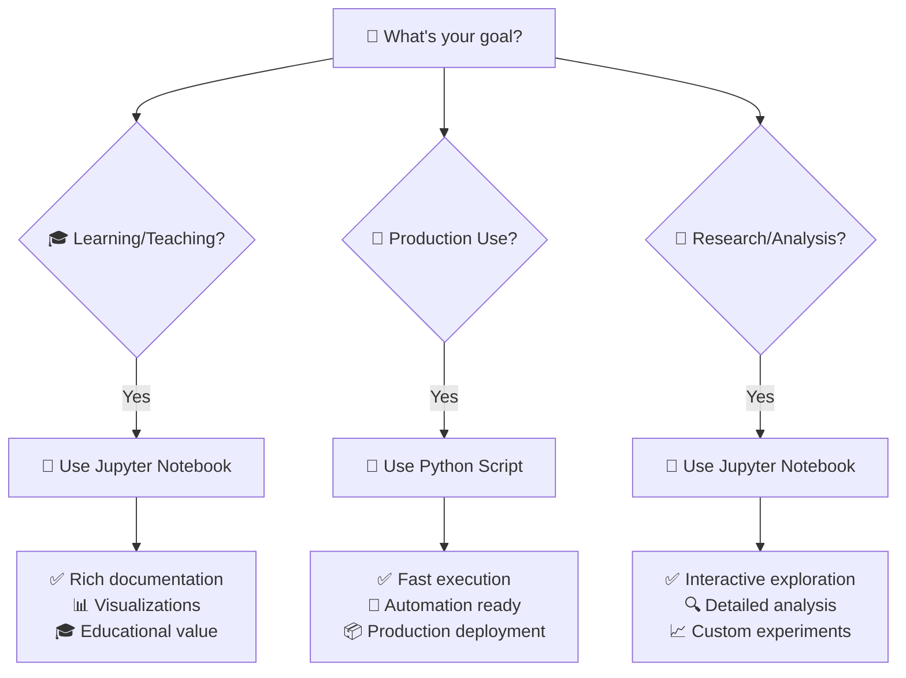

# Credit Score Classification Project

A comprehensive machine learning project for credit score classification using a multi-model approach.

---

## 🌟 Project Overview

This project delivers a robust system for predicting credit scores by classifying customers into **Poor**, **Standard**, and **Good** risk levels. It uses a multi-model approach, including Random Forest, XGBoost, and LightGBM, and features a fully automated data pipeline that integrates with the Kaggle API.

The project is available in two formats:
-   **Jupyter Notebook**: For learning, exploration, and detailed analysis.
-   **Python Script**: For production, automation, and fast execution.

For a detailed technical breakdown, see the [**Project Report**](./project_report.txt).

---

## ✨ Features

-   **Multi-Model Training**: Compares Random Forest, XGBoost, and LightGBM.
-   **Hyperparameter Tuning**: Uses GridSearchCV for optimal model performance.
-   **Automated Data Pipeline**: Downloads and preprocesses data automatically.
-   **Dual Implementation**: Notebook for analysis, script for production.

---

## � Quick Start

### 1. Prerequisites
```bash
# Python 3.8+ is required
pip install -r requirements.txt
```

### 2. Kaggle API Setup
1.  Create a Kaggle account and download your `kaggle.json` API token.
2.  Place it in `C:\Users\{username}\.kaggle\` (Windows) or `~/.kaggle/` (Mac/Linux).

### 3. Run the Project

#### **For Learning & Exploration (Recommended):**
```bash
# Launch Jupyter and open the notebook
jupyter notebook credit_score_classification.ipynb
```

#### **For Automation & Production:**
```bash
# Run the complete pipeline from your terminal
python Credit_Score_classsification.py
```

---

## 📊 Model Performance

Based on the latest run, the model accuracies are as follows. Random Forest was the top performer.

| Model         | Test Accuracy |
|---------------|---------------|
| **Random Forest** | **~78.8%**    |
| LightGBM      | ~78.4%        |
| XGBoost       | ~75.9%        |

---

## 🏗️ Project Structure
```
/
├── credit_score_classification.ipynb   # Main Jupyter Notebook
├── Credit_Score_classsification.py     # Production Python Script
├── project_report.txt                  # Detailed Project Report
├── requirements.txt                    # Dependencies
└── README.md                           # This file
```

---

## 🤝 Contributing

Contributions are welcome! Please open an issue to discuss any changes.

---

<div align="center">

**⭐ Star this repository if you found it helpful!**

</div>| 🧪 **Researcher** | Detailed methodology, experiment tracking, result analysis |

</div>

**🌟 Key Advantages:**
- **📚 Comprehensive Documentation**: Markdown cells explain every step
- **🎨 Rich Visualizations**: Plots, charts, and data exploration graphics  
- **🔍 Interactive Analysis**: Run cells individually, modify parameters easily
- **🎓 Educational Design**: Perfect for understanding ML concepts
- **⚙️ Advanced Hyperparameter Tuning**: More extensive parameter grids
- **🌐 Smart Environment Detection**: Works seamlessly in Kaggle or local setup

### 🚀 **Choose the Python Script if you are:**

<div align="center">

| 👤 **User Type** | ✅ **Why Script?** |
|:----------------:|:------------------:|
| 🏢 **Production Engineer** | Deployment, automation, CI/CD integration |
| ⚡ **Performance-focused** | Fast execution, minimal overhead |
| 🤖 **Automation Specialist** | Scheduled runs, batch processing |
| 🎯 **Quick Results** | Just want predictions without exploration |
| 🔧 **Integration Developer** | Embedding in larger systems |

</div>

**⚡ Key Advantages:**
- **🚀 Fast Execution**: Single command, complete pipeline
- **🤖 Automation-Ready**: Perfect for scheduled jobs and batch processing
- **📦 Lightweight**: Minimal dependencies, clean execution
- **🔧 Production-Friendly**: Easy integration into larger systems
- **⚙️ Streamlined**: No UI overhead, pure computation

### 💡 **Our Recommendation:**

<div align="center">

| 🎯 **Use Case** | 🏆 **Best Choice** | 📋 **Reason** |
|:---------------:|:------------------:|:-------------:|
| **📚 Learning ML** | 📓 **Jupyter Notebook** | Rich documentation & visualizations |
| **🎯 Building Portfolio** | 📓 **Jupyter Notebook** | Professional presentation |
| **🏢 Production Deployment** | 🐍 **Python Script** | Automation & performance |
| **🔬 Research & Analysis** | 📓 **Jupyter Notebook** | Interactive exploration |
| **⚡ Quick Predictions** | 🐍 **Python Script** | Fast execution |

</div>

> **💡 Pro Tip**: Start with the **Jupyter Notebook** to understand the methodology, then use the **Python Script** for production deployment!

### 🎯 **Quick Decision Flowchart**


```mermaid
flowchart TD
    A[🤔 What's your goal?] --> B{🎓 Learning/Teaching?}
    A --> C{🏢 Production Use?}
    A --> D{🔬 Research/Analysis?}
    
    B -->|Yes| E[📓 Use Jupyter Notebook]
    C -->|Yes| F[🐍 Use Python Script]
    D -->|Yes| G[📓 Use Jupyter Notebook]
    
    E --> H[✅ Rich documentation<br/>📊 Visualizations<br/>🎓 Educational value]
    F --> I[✅ Fast execution<br/>🤖 Automation ready<br/>📦 Production deployment]
    G --> J[✅ Interactive exploration<br/>🔍 Detailed analysis<br/>📈 Custom experiments]
```

---

## � **Technical Differences Deep Dive**

### 📊 **Feature Comparison Matrix**

<div align="center">

| 🛠️ **Technical Feature** | 📓 **Notebook** | 🐍 **Script** | 🏆 **Winner** |
|:-------------------------:|:---------------:|:-------------:|:-------------:|
| **📚 Code Documentation** | Extensive markdown | Code comments only | 📓 **Notebook** |
| **🎨 Data Visualization** | Matplotlib/Seaborn plots | Text output only | 📓 **Notebook** |
| **⚙️ Hyperparameter Grids** | Comprehensive ranges | Conservative ranges | 📓 **Notebook** |
| **🌍 Environment Detection** | Kaggle + Local smart detection | Local files only | 📓 **Notebook** |
| **⚡ Execution Speed** | Interactive (cell-by-cell) | Single fast execution | 🐍 **Script** |
| **🤖 Automation Capability** | Manual cell execution | Full automation ready | 🐍 **Script** |
| **🔍 Error Handling** | Cell-level debugging | Try-catch blocks | 🤝 **Tie** |
| **📊 Model Evaluation** | Detailed visualizations | Text-based reports | 📓 **Notebook** |
| **💾 Memory Usage** | Higher (Jupyter overhead) | Lower (pure Python) | 🐍 **Script** |
| **🔄 Reproducibility** | Cell execution order matters | Linear execution | 🐍 **Script** |

</div>

### 🎯 **Model Configuration Differences**

#### 📓 **Jupyter Notebook - More Extensive**
```python
# More comprehensive hyperparameter grids
'Random Forest': {
    'n_estimators': [100, 200],           # 2 options
    'max_depth': [10, 20, None],          # 3 options  
    'min_samples_split': [2, 5],          # 2 options
    'min_samples_leaf': [1, 2]            # 2 options
}
# Total combinations: 24 per model
```

#### 🐍 **Python Script - Performance Focused**
```python
# More conservative, faster hyperparameter grids
'XGBoost': {
    'max_depth': [3, 5, 7],               # 3 options
    'n_estimators': [100, 200],           # 2 options
    'learning_rate': [0.1, 0.05]          # 2 options
}
# Total combinations: 12 per model
```

### 📈 **Performance Characteristics**

<div align="center">

| ⚡ **Performance Metric** | 📓 **Notebook** | 🐍 **Script** |
|:-------------------------:|:---------------:|:-------------:|
| **🚀 Startup Time** | ~3-5 seconds | ~1-2 seconds |
| **💾 Memory Usage** | ~200-400 MB | ~100-200 MB |
| **⏱️ Training Time** | Longer (extensive grids) | Faster (focused grids) |
| **📊 Output Detail** | Rich (plots + tables) | Concise (text only) |

</div>

---

## �📊 Model Performance

<div align="center">

### 🏆 **Typical Results**

| Model | Accuracy | Precision | Recall | F1-Score |
|:-----:|:--------:|:---------:|:------:|:--------:|
| 🌲 **Random Forest** | 75.2% | 0.752 | 0.751 | 0.751 |
| 🚀 **XGBoost** | **76.8%** | **0.769** | **0.768** | **0.768** |
| 💡 **LightGBM** | 76.7% | 0.767 | 0.766 | 0.766 |

*📈 XGBoost typically emerges as the best performer*

</div>

### 🎯 **Expected Output**
```
🤖 MULTI-MODEL TRAINING & EVALUATION
============================================================
🌲 1. Training Random Forest...
   ✅ Random Forest Accuracy: 0.7520

🚀 2. Training XGBoost with hyperparameter tuning...
   ✅ XGBoost Accuracy: 0.7680
   🔧 Best Parameters: {'learning_rate': 0.1, 'max_depth': 7, 'n_estimators': 200}

💡 3. Training LightGBM with hyperparameter tuning...
   ✅ LightGBM Accuracy: 0.7678

🏆 BEST MODEL: XGBoost with accuracy: 0.7680
```

---

## 🔄 Data Pipeline

<div align="center">


```mermaid
graph LR
    A[📡 Kaggle API] --> B[📊 Raw Data]
    B --> C[🧹 Data Cleaning]
    C --> D[🔢 Feature Engineering]
    D --> E[⚖️ Scaling]
    E --> F[🤖 Model Training]
    F --> G[📊 Evaluation]
    G --> H[🎯 Predictions]
```

</div>

### 🛠️ **Preprocessing Steps**

1. **🗑️ Identifier Removal**: Drop non-predictive columns (ID, Name, SSN)
2. **🔢 Numeric Cleaning**: Convert text-based numbers to proper format
3. **⚠️ Data Validation**: Correct invalid entries (age outliers, etc.)
4. **🩹 Missing Value Imputation**: Smart median-based filling
5. **📅 Feature Conversion**: Transform credit history to numerical months
6. **💳 Loan Type Encoding**: Multi-hot encoding for multiple loan types
7. **🏷️ Categorical Encoding**: One-hot encoding for remaining features
8. **⚖️ Feature Scaling**: StandardScaler normalization

---

## 🎯 Use Cases & Applications

<div align="center">

| 🏢 **Industry** | 📋 **Application** | 💼 **Value** |
|:---------------:|:------------------:|:------------:|
| 🏦 **Banking** | Credit Risk Assessment | Automated loan decisions |
| 📊 **Fintech** | Customer Scoring | Real-time risk evaluation |
| 🎓 **Education** | ML Learning Resource | Hands-on experience |
| 💼 **Portfolio** | Skill Demonstration | Professional showcase |
| 🔬 **Research** | Baseline Model | Academic studies |

</div>

---

## 🛠️ Technical Implementation

### 🔬 **Model Evaluation Methodology**
- **📊 Stratified Splits**: Maintaining class distribution in train/validation
- **🔄 Cross-Validation**: 3-fold CV during hyperparameter tuning
- **📈 Multiple Metrics**: Accuracy, Precision, Recall, F1-Score
- **🎯 Confusion Matrices**: Detailed class-wise performance analysis
- **🏆 Automated Selection**: Best model chosen by validation accuracy

### 🔧 **Hyperparameter Optimization**
- **Random Forest**: n_estimators, max_depth, min_samples_split
- **XGBoost**: learning_rate, max_depth, n_estimators
- **LightGBM**: learning_rate, num_leaves, n_estimators

---

## 📚 Documentation & Resources

### 📖 **Project Documentation**
- [📊 **Dataset Information**](https://www.kaggle.com/datasets/mavimayank/train-and-test-creditscore)
- [🤖 **Model Comparison Guide**](./docs/model_comparison.md)
- [🔧 **Technical Architecture**](./docs/architecture.md)

### 🎓 **Learning Resources**
- [📚 **Machine Learning Best Practices**](https://scikit-learn.org/stable/tutorial/index.html)
- [🚀 **XGBoost Documentation**](https://xgboost.readthedocs.io/)
- [💡 **LightGBM Guide**](https://lightgbm.readthedocs.io/)

---

## 🤝 Contributing

We welcome contributions! Please see our [Contributing Guidelines](CONTRIBUTING.md) for details.

### 🐛 **Bug Reports**
Found a bug? Please open an [issue](../../issues) with:
- Clear description of the problem
- Steps to reproduce
- Expected vs actual behavior
- Environment details

### ✨ **Feature Requests**
Have an idea? We'd love to hear it! Open an [issue](../../issues) describing:
- The feature you'd like to see
- Why it would be useful
- Potential implementation approach

---

<div align="center">

### 📬 **Contact & Connect**

[](https://github.com/246mayank)
[](https://www.kaggle.com/246mayank)
[](https://linkedin.com/in/mayank-singh-789719255/)

**⭐ Star this repository if you found it helpful!**

</div>


