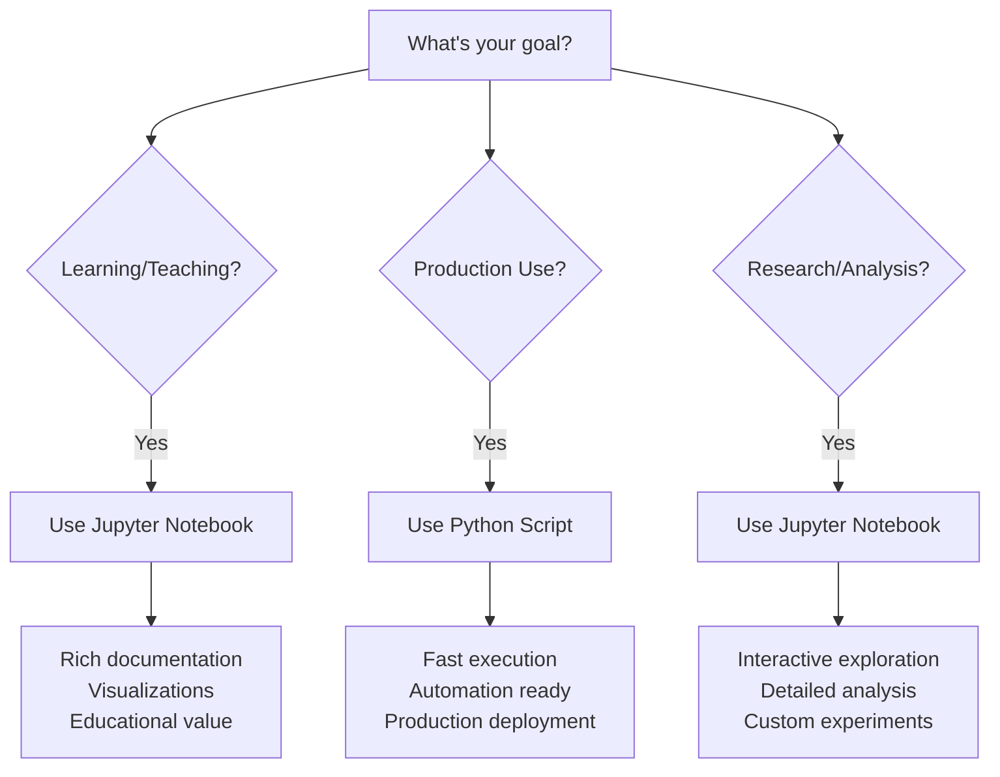

# Credit Score Classification Project

<div align="center">


**🚀 A comprehensive machine learning project delivering robust credit score classification with state-of-the-art models**

[🔍 **Explore the Code**](./credit_score_classification.ipynb) • [📊 **View Dataset**](https://www.kaggle.com/datasets/mavimayank/train-and-test-creditscore) • [📈 **See Results**](#-model-performance)

</div>

---

## 🌟 Project Overview

This project delivers a robust system for predicting credit scores by classifying customers into **Poor**, **Standard**, and **Good** risk levels. It uses a multi-model approach, including Random Forest, XGBoost, and LightGBM, and features a fully automated data pipeline that integrates with the Kaggle API.

The project is available in two formats:
-   **Jupyter Notebook**: For learning, exploration, and detailed analysis.
-   **Python Script**: For production, automation, and fast execution.

For a detailed technical breakdown, see the [**Project Report**](./project_report.txt).

---

## ✨ Features

-   **Multi-Model Training**: Compares Random Forest, XGBoost, and LightGBM.
-   **Hyperparameter Tuning**: Uses GridSearchCV for optimal model performance.
-   **Automated Data Pipeline**: Downloads and preprocesses data automatically.
-   **Dual Implementation**: Notebook for analysis, script for production.

---

## � Quick Start

### 1. Prerequisites
```bash
# Python 3.8+ is required
pip install -r requirements.txt
```

### 2. Kaggle API Setup
1.  Create a Kaggle account and download your `kaggle.json` API token.
2.  Place it in `C:\Users\{username}\.kaggle\` (Windows) or `~/.kaggle/` (Mac/Linux).

### 3. Run the Project

#### **For Learning & Exploration (Recommended):**
```bash
# Launch Jupyter and open the notebook
jupyter notebook credit_score_classification.ipynb
```

#### **For Automation & Production:**
```bash
# Run the complete pipeline from your terminal
python Credit_Score_classsification.py
```

---

## 📊 Model Performance

Based on the latest run, the model accuracies are as follows. Random Forest was the top performer.

| Model         | Test Accuracy |
|---------------|---------------|
| **Random Forest** | **~78.8%**    |
| LightGBM      | ~78.4%        |
| XGBoost       | ~75.9%        |

---


</div>

</div>

**Key Advantages:**
- Comprehensive Documentation: Markdown cells explain every step
- Rich Visualizations: Plots, charts, and data exploration graphics  
- Interactive Analysis: Run cells individually, modify parameters easily
- Educational Design: Perfect for understanding ML concepts
- Advanced Hyperparameter Tuning: More extensive parameter grids
- Smart Environment Detection: Works seamlessly in Kaggle or local setup

### 🚀 **Choose the Python Script if you are:**

<div align="center">

| User Type | Why Script? |
|:----------------:|:------------------:|
| Production Engineer | Deployment, automation, CI/CD integration |
| Performance-focused | Fast execution, minimal overhead |
| Automation Specialist | Scheduled runs, batch processing |
| Quick Results | Just want predictions without exploration |
| Integration Developer | Embedding in larger systems |

</div>

**Key Advantages:**
- Fast Execution: Single command, complete pipeline
- Automation-Ready: Perfect for scheduled jobs and batch processing
- Lightweight: Minimal dependencies, clean execution
- Production-Friendly: Easy integration into larger systems
- Streamlined: No UI overhead, pure computation

### 💡 **Our Recommendation:**

<div align="center">

| Use Case | Best Choice | Reason |
|:---------------:|:------------------:|:-------------:|
| Learning ML | Jupyter Notebook | Rich documentation & visualizations |
| Building Portfolio | Jupyter Notebook | Professional presentation |
| Production Deployment | Python Script | Automation & performance |
| Research & Analysis | Jupyter Notebook | Interactive exploration |
| Quick Predictions | Python Script | Fast execution |

</div>

> **Pro Tip**: Start with the **Jupyter Notebook** to understand the methodology, then use the **Python Script** for production deployment!

### 🎯 **Quick Decision Flowchart**



---

## � **Technical Differences Deep Dive**

### 📊 **Feature Comparison Matrix**

<div align="center">

| Technical Feature          | Notebook                     | Script                     | Winner      |
|----------------------------|------------------------------|----------------------------|-------------|
| Code Documentation         | Extensive markdown           | Code comments only         | Notebook    |
| Data Visualization         | Matplotlib/Seaborn plots     | Text output only           | Notebook    |
| Execution Speed            | Interactive (cell-by-cell)   | Single fast execution      | Script      |
| Error Handling             | Cell-level debugging         | Try-catch blocks           | Tie         |
| Reproducibility            | Cell execution order matters | Linear execution           | Script      |

</div>

### 🎯 **Model Configuration Differences**

#### 📓 **Jupyter Notebook - More Extensive**
```python
# More comprehensive hyperparameter grids
'Random Forest': {
    'n_estimators': [100, 200],           # 2 options
    'max_depth': [10, 20, None],          # 3 options  
    'min_samples_split': [2, 5],          # 2 options
    'min_samples_leaf': [1, 2]            # 2 options
}
# Total combinations: 24 per model
```

#### 🐍 **Python Script - Performance Focused**
```python
# More conservative, faster hyperparameter grids
'XGBoost': {
    'max_depth': [3, 5, 7],               # 3 options
    'n_estimators': [100, 200],           # 2 options
    'learning_rate': [0.1, 0.05]          # 2 options
}
# Total combinations: 12 per model
```

### 📈 **Performance Characteristics**

<div align="center">

| Performance Metric | Notebook | Script |
|:-------------------------:|:---------------:|:-------------:|
| Startup Time | ~3-5 seconds | ~1-2 seconds |
| Memory Usage | ~200-400 MB | ~100-200 MB |
| Training Time | Longer (extensive grids) | Faster (focused grids) |
| Output Detail | Rich (plots + tables) | Concise (text only) |

</div>

---

## 📊 Model Performance

<div align="center">

### **Typical Results**

| Model | Accuracy | Precision | Recall | F1-Score |
|:-----:|:--------:|:---------:|:------:|:--------:|
| Random Forest | 75.2% | 0.752 | 0.751 | 0.751 |
| XGBoost | **76.8%** | **0.769** | **0.768** | **0.768** |
| LightGBM | 76.7% | 0.767 | 0.766 | 0.766 |

*XGBoost typically emerges as the best performer*

</div>

### 🎯 **Expected Output**
```
MULTI-MODEL TRAINING & EVALUATION
============================================================
1. Training Random Forest...
   Random Forest Accuracy: 0.7520

2. Training XGBoost with hyperparameter tuning...
   XGBoost Accuracy: 0.7680
   Best Parameters: {'learning_rate': 0.1, 'max_depth': 7, 'n_estimators': 200}

3. Training LightGBM with hyperparameter tuning...
   LightGBM Accuracy: 0.7678

BEST MODEL: XGBoost with accuracy: 0.7680
```

---

## 🔄 Data Pipeline

<div align="center">


</div>

### 🛠️ **Preprocessing Steps**

1. **Identifier Removal**: Drop non-predictive columns (ID, Name, SSN)
2. **Numeric Cleaning**: Convert text-based numbers to proper format
3. **Data Validation**: Correct invalid entries (age outliers, etc.)
4. **Missing Value Imputation**: Smart median-based filling
5. **Feature Conversion**: Transform credit history to numerical months
6. **Loan Type Encoding**: Multi-hot encoding for multiple loan types
7. **Categorical Encoding**: One-hot encoding for remaining features
8. **Feature Scaling**: StandardScaler normalization

---

## 🎯 Use Cases & Applications

<div align="center">

| Industry | Application | Value |
|:---------------:|:------------------:|:------------:|
| Banking | Credit Risk Assessment | Automated loan decisions |
| Fintech | Customer Scoring | Real-time risk evaluation |
| Education | ML Learning Resource | Hands-on experience |
| Portfolio | Skill Demonstration | Professional showcase |
| Research | Baseline Model | Academic studies |

</div>

---

## 🛠️ Technical Implementation

### **Model Evaluation Methodology**
- Stratified Splits: Maintaining class distribution in train/validation
- Cross-Validation: 3-fold CV during hyperparameter tuning
- Multiple Metrics: Accuracy, Precision, Recall, F1-Score
- Confusion Matrices: Detailed class-wise performance analysis
- Automated Selection: Best model chosen by validation accuracy

### **Hyperparameter Optimization**
- Random Forest: n_estimators, max_depth, min_samples_split
- XGBoost: learning_rate, max_depth, n_estimators
- LightGBM: learning_rate, num_leaves, n_estimators

---

## 📚 Documentation & Resources

### **Project Documentation**
- [**Dataset Information**](https://www.kaggle.com/datasets/mavimayank/train-and-test-creditscore)
- [**Model Comparison Guide**](./docs/model_comparison.md)
- [**Technical Architecture**](./docs/architecture.md)

### **Learning Resources**
- [**Machine Learning Best Practices**](https://scikit-learn.org/stable/tutorial/index.html)
- [**XGBoost Documentation**](https://xgboost.readthedocs.io/)
- [**LightGBM Guide**](https://lightgbm.readthedocs.io/)

---


### **Bug Reports**
Found a bug? Please open an [issue](../../issues) with:
- Clear description of the problem
- Steps to reproduce
- Expected vs actual behavior
- Environment details

### **Feature Requests**
Have an idea? We'd love to hear it! Open an [issue](../../issues) describing:
- The feature you'd like to see
- Why it would be useful
- Potential implementation approach

---

<div align="center">

### 📬 **Contact & Connect**

[](https://github.com/246mayank)
[](https://www.kaggle.com/246mayank)
[](https://linkedin.com/in/mayank-singh-789719255/)

**⭐ Star this repository if you found it helpful!**

</div>


